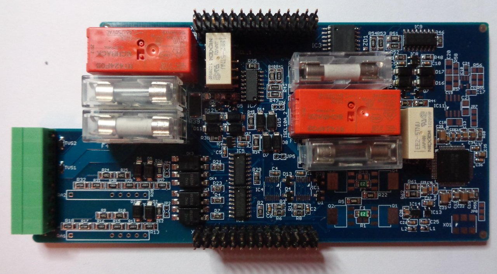

The [EEZ DIB](https://github.com/eez-open/modular-psu) 4-channel Hi-voltage/Hi-current AFE for [MIO168](https://github.com/eez-open/dib-mio168) module.

### Feature list
* [ADS131E04](https://www.ti.com/product/ADS131E04) 24-bit 4-channel simultaneous sampling ADC with SPI
* 5½ digit effective resolution
* 2 x Hi-voltage channels featuring software selectable 3 measurement ranges (±2.4 V, ±12 V, ±240 V), and one current range (±240 mA)
* 2 x Hi-current channels featuring software selectable 3 measurement ranes (±24 mA, ±1 A, ±10 A) and 2 voltage ranges (±2.4 V, ±15 V)
* Latching relays for lower continous power consumption
* On-board ±2.5 V low noise LDOs
* Active clamps on ADC inputs
* 20 x 5 mm fueses on hi-current channels (Ch3 and Ch4)
* Dimensions: 141.5 x 68.5 mm, 4-layer PCB

### r1B2 prototype

